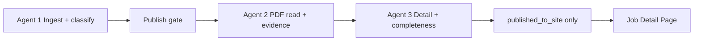

# Live Jobs Pipeline (3 Agents)

## Architecture



| Agent | Code | Role |
|-------|------|------|
| **1 — Live jobs** | `backend/app/agents/ingest_agent.py` | Scrape → **classify recruitment** → draft unless verified |
| **2 — PDF reader** | `backend/app/agents/pdf_reader_agent.py` | Primary PDF score → extract → quality gate |
| **3 — Job details** | `backend/app/agents/job_detail_agent.py` | Completeness ≥70 to publish; no weak-summary pages |
| **Gate** | `publish_gate.py` + `document_classifier.py` | `verification_status`, `published_to_site`, `completeness_score` |
| **Source health** | `source_health_agent.py` | Probe registry portals (`npm run health:sources`) |

**Default:** `AUTO_PUBLISH_VERIFIED=0` — new ingest stays `draft` / `NEEDS_REVIEW` until admin publish.

**Detail priority:** PDF memorized > official notification > live listing scrape.

## Commands

```bash
# Full pipeline (daily sync + PDF + details)
npm run pipeline:live:full

# After daily sync already ran today
npm run pipeline:live

# Individual agents
npm run daily:sync          # Agent 1
npm run pdf:read:live       # Agent 2
npm run job:details         # Agent 3
npm run pdf:backfill        # Find missing PDF URLs (228 jobs)
```

## Job detail page

- Loads from API/Supabase → Storage → `/data/job-details/<slug>.json`
- When `detail.memorized_at` or `detail_source=pdf`, UI shows **PDF summary** even without full `content_sections`
- Static mode: commit `live-jobs.json` + `job-details/` after pipeline

## After pipeline — health check

When jobs look wrong on the site, or after a big sync/deploy, run **Agent 4**:

```bash
npm run health:website          # local code/data/env
npm run health:website:full     # + production + live probes
```

Skill: `.cursor/skills/website-health-agent/`

## What's not automatic yet

- **OCR** for scanned PDFs still needs Tesseract locally (`PDF_OCR_ENABLED=1`)
- **Custom parsers** for top boards (UPSC/SSC/…) beyond `rss_feed` / `state_portal_html`
- **Full admin UI** for review queues (API ready: `GET /api/admin/review-queues`)
- Re-export static `live-jobs.json` after scrubbing so CDN snapshot matches the gate
