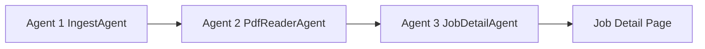

# Live Jobs Pipeline (3 Agents)

## Architecture



| Agent | Code | Role |
|-------|------|------|
| **1 — Live jobs** | `backend/app/agents/ingest_agent.py` | Scrape official sites → new live jobs in Supabase + `live-jobs.json` |
| **2 — PDF reader** | `backend/app/agents/pdf_reader_agent.py` | Download PDFs → `summary`, vacancies, dates → DB |
| **3 — Job details** | `backend/app/agents/job_detail_agent.py` | Build UI detail (sections, static JSON, Storage) |

**Detail priority:** PDF memorized > official notification > live listing scrape.

## Commands

```bash
# Full pipeline (daily sync + PDF + details)
npm run pipeline:live:full

# After daily sync already ran today
npm run pipeline:live

# Individual agents
npm run daily:sync          # Agent 1
npm run pdf:read:live       # Agent 2
npm run job:details         # Agent 3
npm run pdf:backfill        # Find missing PDF URLs (228 jobs)
```

## Job detail page

- Loads from API/Supabase → Storage → `/data/job-details/<slug>.json`
- When `detail.memorized_at` or `detail_source=pdf`, UI shows **PDF summary** even without full `content_sections`
- Static mode: commit `live-jobs.json` + `job-details/` after pipeline

## What's not automatic yet

- **OCR** for scanned image PDFs (needs Tesseract on Windows)
- **228 jobs** without any PDF URL — run `npm run pdf:backfill`
- **Daily sync** uses `--skip-enrich` by default — use `pipeline:live:full` or `daily:sync:full` for PDF in one step
